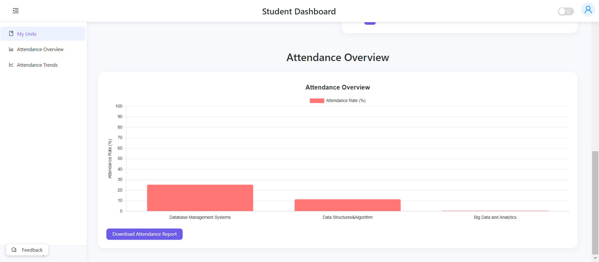
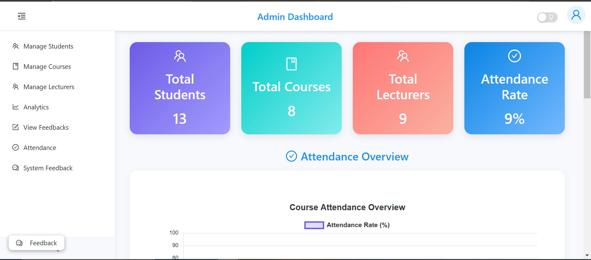

# QRollCall - Smart QR Code based Student Attendance System

QRollCall is a comprehensive web-based attendance tracking application designed for educational institutions. It uses QR code technology for efficient attendance management, allowing lecturers to generate unique QR codes for each session that students can scan to mark their attendance.






## Table of Contents
- [Features](#features)
- [Tech Stack](#tech-stack)
- [Architecture](#architecture)
- [Installation](#installation)
  - [Backend Setup](#backend-setup)
  - [Frontend Setup](#frontend-setup)
- [Usage Guide](#usage-guide)
  - [Admin Guide](#admin-guide)
  - [Lecturer Guide](#lecturer-guide)
  - [Student Guide](#student-guide)
- [API Documentation](#api-documentation)
- [PWA Support](#pwa-support)
- [Offline Mode](#offline-mode)
- [Security](#security)
- [Contributors](#contributors)
- [License](#license)

## Features

### Core Features
- **QR Code-based Attendance**: Generate and scan QR codes for quick attendance marking
- **Real-time Tracking**: Monitor attendance in real-time with instant updates
- **Auto Refresh Capability**: Automatically refresh data without manual intervention
- **Role-based Access Control**: Different interfaces for students, lecturers, and administrators
- **Analytics Dashboard**: Comprehensive attendance statistics and reports
- **Feedback System**: Collect and analyze student feedback after sessions
- **Progressive Web App**: Install on devices for offline and native-like functionality

### User-Specific Features

#### For Students
- Easy scanning of QR codes to mark attendance
- Personal attendance history and statistics
- Course and unit management
- Feedback submission for completed sessions

#### For Lecturers
- Quick session creation with auto-expiring QR codes
- Real-time view of attending students
- Historical session data and analytics
- Student performance tracking per unit
- Feedback review from students

#### For Administrators
- Institution-wide attendance analytics
- Department and course management
- User management for students and lecturers
- Bulk operations via CSV imports/exports
- System configuration and settings

## Tech Stack

### Frontend
- **Framework**: React.js
- **UI Library**: Ant Design
- **State Management**: Context API
- **Routing**: React Router
- **HTTP Client**: Axios
- **PWA Support**: VitePWA
- **Data Visualization**: Chart.js with React-Chartjs-2
- **QR Code Handling**: react-qr-code, react-qr-reader
- **Build Tool**: Vite

### Backend
- **Runtime**: Node.js
- **Framework**: Express.js
- **Database**: MongoDB with Mongoose ODM
- **Authentication**: JWT (JSON Web Tokens)
- **API Documentation**: Express-based documentation (Swagger integration planned)
- **File Handling**: Multer
- **Email Services**: Nodemailer
- **Data Validation**: Express-validator
- **Security Middleware**: Helmet, CORS
- **Logging**: Winston
- **Task Scheduling**: Node-schedule

## Architecture

The application follows a client-server architecture:

- **Frontend**: Single-page application built with React
- **Backend**: RESTful API service built with Express.js
- **Database**: MongoDB document database
- **Authentication**: JWT token-based auth (single token strategy)
- **Caching**: Service worker and IndexedDB for offline capabilities

## Installation

### Prerequisites
- Node.js (v14+)
- npm or yarn
- MongoDB (local or Atlas connection)
- Git

### Backend Setup

1. Clone the repository:
```bash
git clone https://github.com/yourusername/attendance-system.git
cd attendance-system/backend
```

2. Install dependencies:
```bash
npm install
```

3. Create a `.env` file in the backend directory:
```
PORT=5000
MONGO_URI=mongodb://localhost:27017/attendance-system
JWT_SECRET=your_jwt_secret_key
SMTP_HOST=smtp.gmail.com
SMTP_PORT=587
SMTP_USER=your-email@example.com
SMTP_PASS=your-app-password
CLIENT_URL_DEV=http://localhost:5173
CLIENT_URL_PROD=https://your-production-url.com
```

4. Start the backend server:
```bash
npm start
```
For development with nodemon:
```bash
npm run dev
```

### Frontend Setup

1. Navigate to the frontend directory:
```bash
cd ../frontend
```

2. Install dependencies:
```bash
npm install
```

3. Create a `.env` file in the frontend directory:
```
VITE_API_URL=http://localhost:5000/api
```

4. Start the development server:
```bash
npm run dev
```

5. Build for production:
```bash
npm run build
```

## Usage Guide

### Admin Guide

#### Initial Setup
1. Login with the default admin credentials (email: admin@example.com, password: adminpassword)
2. Update your admin profile and password for security
3. Set up departments and courses structure
4. Import or add lecturers and students

#### User Management
1. Navigate to the Admin Panel > Manage Students/courses/Lecturers
2. Create, edit, or delete users as needed
3. Bulk import users via CSV/excel templates(available for download)

#### System Configuration
1. Manage departments and courses
2. Configure semester dates and attendance policies
3. View system analytics and reports

### Lecturer Guide

#### Session Management
1. Login to your lecturer account
2. Navigate to your dashboard
3. Select a unit to create a new session
4. Set session duration and click "Generate QR Code"
5. Display the QR code for students to scan
6. Monitor attendance in real-time
7. End session manually or let it auto-end at the set time

#### Review Attendance
1. Navigate to Analytics > Attendance Records
2. Filter by unit, date range, or student
3. Export attendance reports as needed

#### Feedback Review
1. Go to Feedback section
2. View and analyze student feedback by session or unit

### Student Guide

#### Marking Attendance
1. Login to your student account
2. Go to the QR Scanner page
3. Select the relevant unit
4. Scan the QR code displayed by your lecturer
5. Confirm your attendance was successfully recorded

#### Reviewing Your Attendance
1. Navigate to My Attendance to see your attendance history
2. View attendance rates per unit and overall

#### Submitting Feedback
1. After a session ends, you'll be prompted to provide feedback
2. Rate different aspects of the session and submit comments

## API Documentation

The backend API is organized into the following main routes:

### Authentication Endpoints
- `POST /api/auth/login` - User login
- `POST /api/auth/signup` - User registration
- `POST /api/auth/reset-password` - Request password reset
- `PUT /api/auth/reset-password/:token` - Reset password with token

### User Management
- `GET /api/users/profile` - Get user profile
- `PUT /api/users/profile/update` - Update user profile
- `GET /api/students` - Get all students
- `PUT /api/students/:id` - Update student information
- `DELETE /api/students/:id` - Delete student

### Department & Course Management
- `POST /api/department/create` - Create department
- `GET /api/department` - Get all departments
- `POST /api/course/create` - Create course
- `GET /api/course` - Get all courses
- `GET /api/course/:departmentId` - Get courses by department

### Unit Management
- `POST /api/unit/add` - Add a unit
- `GET /api/unit` - Get all units
- `PUT /api/unit/:id` - Update unit
- `DELETE /api/unit/:id` - Delete unit

### Attendance Management
- `POST /api/attendance/mark` - Mark attendance
- `GET /api/attendance/student/:studentId` - Get student's attendance
- `GET /api/attendance/session/:sessionId` - Get session attendance
- `GET /api/attendance/trends/:unitId` - Get attendance trends

### Session Management
- `POST /api/sessions/create` - Create a new session
- `POST /api/sessions/regenerate-qr` - Regenerate QR code
- `POST /api/sessions/end` - End a session
- `GET /api/sessions/active/:unitId` - Get active session

### Feedback System
- `POST /api/feedback/submit` - Submit feedback
- `GET /api/feedback/lecturer` - Get feedback for lecturer
- `GET /api/feedback/summary` - Get feedback summary

## PWA Support

QRollCall includes Progressive Web App (PWA) support:

- Installable on mobile and desktop devices
- Basic offline access to previously viewed content
- Online/offline status indicators
- Service worker for asset caching

To install the PWA:
1. Open the application in a supported browser
2. Click the "Install" button in the header
3. Follow the prompts to add the app to your home screen

## Offline Mode

The application implements a robust offline strategy:

- Session data is cached for offline viewing
- Attendance marking requires an internet connection to validate QR codes
- Previously loaded profile and course data is available offline
- IndexedDB stores user profile and relevant course information
- Clear visual indicators show online/offline status
- Automatic reconnection and synchronization when connection is restored

## Security

The system implements several security measures:

- JWT-based authentication with token expiration
- Password hashing using bcrypt
- HTTPS for all communications
- Input validation and sanitization
- CORS protection against unauthorized domains
- Rate limiting to prevent brute force attacks
- QR codes that expire quickly to prevent sharing

## Contributors

- [Austin Kuria](https://github.com/Austinkuria)
- [Larry Bett](https://github.com/LlaryBett)

## License

This project is licensed under the MIT License - see the file for details
