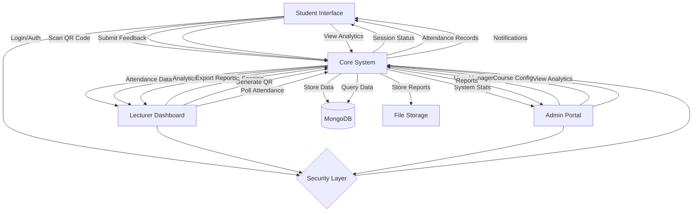

CHAPTER 4: 
SYSTEM DESIGN

Introduction
The QR Code-based Smart Attendance System is a Progressive Web Application (PWA) designed to modernize student attendance tracking. The system is built using:

Technical Architecture:
- Frontend: React.js with Vite, Ant Design UI framework
- Backend: Node.js, Express
- Database: MongoDB with Mongoose ODM
- API: RESTful architecture with JWT authentication
- Data Persistence: Browser localStorage with basic IndexedDB integration
- Deployment: Client on Vercel, Server on Render.com

Core Components:
1. Frontend Application
   - Progressive Web App with basic offline capabilities
   - Ant Design UI components with custom theming (light/dark mode)
   - QR code scanner integration using device cameras
   - Auto-refreshing data through polling mechanisms
   - Local storage for session management and caching

2. Backend Services
   - Express REST API endpoints with MVC architecture
   - JWT authentication with token refresh mechanism
   - Rate limiting to prevent abuse
   - CSV file handling for bulk imports/exports
   - MongoDB data operations with Mongoose ODM

3. Database Architecture
   - Document-based MongoDB collections
   - Core collections: Users, Sessions, Attendance, Units, Courses, Departments
   - Reference-based relationships through MongoDB ObjectIDs

Requirements
Functional Requirements (Implemented):

1. Authentication & Authorization
   - JWT-based secure authentication with refresh tokens
   - Role-based access control (Admin/Lecturer/Student)
   - Password reset functionality
   - Device identification for security

2. Session Management
   - QR code generation with automatic refresh every 25-30 seconds
   - Session state persistence using localStorage
   - Session timing controls (start/end)
   - Manual attendance status overrides by lecturers

3. Anti-Spoofing Measures
   - Device fingerprinting through browser information (audio, canvas, WebGL, GPU and system fonts)
   - IP address tracking and time-based conflict detection
   - QR code expiration and rotation with SHA-256 hash verification
   - Session token validation
   - Rate limiting on attendance marking

4. Data Management
   - Bulk student import/export via CSV
   - Course and unit management
   - Department organization
   - Attendance records export in CSV/Excel format
   - Basic analytics and reporting

5. User Experience
   - Responsive design for mobile and desktop
   - Light/dark theme support
   - Offline access to previously loaded data
   - Basic caching for performance

Non-Functional Requirements:
1. Security
   - Secure authentication with JWT
   - Device fingerprinting validation
   - Role-based access control
   - Input validation and sanitization
   - API rate limiting

2. Performance
   - Optimized database queries
   - Client-side caching of frequently accessed data
   - Basic offline functionality through localStorage
   - Automatic data refresh mechanisms

3. Usability
   - Responsive mobile-first design
   - Intuitive user interface with Ant Design
   - Theme customization (light/dark mode)
   - Cross-browser compatibility

4. Reliability
   - Error handling and user feedback
   - Automatic session cleanup
   - Token refresh mechanism
   - Data validation

5. Scalability
   - Modular architecture
   - Separate frontend/backend for independent scaling
   - Cloud deployment ready
   - API-based architecture for future extensibility

6. Maintainability
   - Component-based frontend design
   - MVC pattern in backend
   - Central configuration
   - Environment variable management

Context Level Diagram
The following diagram illustrates the high-level context of the QR Code-based Smart Attendance System as actually implemented:

```mermaid
graph TD
    %% Main System
    SYS[QR Code-based Smart<br>Attendance System] 
    
    %% External Actors - Only those actually implemented
    STU[Student]
    LEC[Lecturer]
    ADM[Administrator]
    DB[(MongoDB Database)]
    STORE[CSV/Excel Export Storage]
    
    %% Interactions - Students (actually implemented)
    STU -->|Authenticates via JWT| SYS
    STU -->|Scans QR codes with device fingerprinting| SYS
    STU -->|Views attendance history| SYS
    STU -->|Submits session feedback| SYS
    SYS -->|Returns attendance status| STU
    SYS -->|Displays feedback request notifications| STU
    
    %% Interactions - Lecturers (actually implemented)
    LEC -->|Authenticates via JWT| SYS
    LEC -->|Creates attendance sessions| SYS
    LEC -->|Generates QR codes with auto-refresh| SYS
    LEC -->|Uses polling for attendance data updates| SYS
    LEC -->|Exports attendance reports| SYS
    SYS -->|Displays attendance data| LEC
    SYS -->|Provides unit/course analytics| LEC
    
    %% Interactions - Admins (actually implemented)
    ADM -->|Authenticates via JWT| SYS
    ADM -->|Manages user accounts| SYS
    ADM -->|Configures courses/units/departments| SYS
    ADM -->|Views system analytics| SYS
    SYS -->|Provides administrative reports| ADM
    
    %% Interactions - External Systems (actually implemented)
    SYS <-->|Stores/retrieves data| DB
    SYS -->|Generates exportable reports| STORE
    
    %% Styling
    classDef system fill:#f96,stroke:#333,stroke-width:2px;
    classDef users fill:#bbf,stroke:#333,stroke-width:1px;
    classDef external fill:#bfb,stroke:#333,stroke-width:1px;
    
    class SYS system;
    class STU,LEC,ADM users;
    class DB,STORE external;
```

This diagram accurately represents the QR Code-based Smart Attendance System as implemented, showing:

1. The three user roles (Students, Lecturers, Administrators) with their actual system interactions
2. External systems integration with MongoDB database and report export functionality
3. The key data flows as implemented in the codebase, including:
   - JWT authentication for all users
   - Device fingerprinting for anti-spoofing measures
   - Auto-refreshing QR codes with 3-minute rotation
   - Polling-based data refresh (not WebSockets)
   - CSV/Excel data export capabilities
   - In-app notifications for pending feedback requests

Data Flow Diagram:
[Context Level Data Flow]

1. Student → System:
   - Login credentials
   - QR code scans
   - Session feedback
   - Device fingerprint
   - Attendance records requests

2. System → Student:
   - Authentication tokens
   - Session status updates
   - Attendance confirmations
   - Course analytics
   - Unit-wise reports
   - In-app notifications

3. Lecturer → System:
   - Session creation requests
   - QR code generation triggers
   - Attendance data polling
   - Report generation requests
   - Student performance queries

4. System → Lecturer:
   - Attendance data
   - Session analytics
   - Student feedback reports
   - Course performance metrics
   - Export data (CSV/Excel)

5. Admin → System:
   - User management operations
   - Course/Unit configurations
   - System settings updates
   - Bulk data imports
   - Analytics requests

6. System → Admin:
   - System-wide analytics
   - User activity logs
   - Performance reports
   - Audit trails
   - Export data (All formats)

7. External Services ↔ System:
   - Database: CRUD operations
   - File system: Report storage

8. Cross-Cutting Flows:
   - JWT tokens for authentication
   - Device fingerprints for verification
   - Polling for data updates
   - Browser storage synchronization
   - Error logs and alerts

Data Flow Implementation:

1. Authentication Flows:
   - Login/Signup via /api/auth/* endpoints
   - JWT token generation and validation
   - Token refresh mechanism
   - Role-based access control (Student/Lecturer/Admin)

2. Student Flows:
   - Attendance marking via QR code scanning
   - Session status checking via polling
   - Feedback submission for attended sessions
   - Attendance history and analytics view

3. Lecturer Flows:
   - Session creation and management 
   - QR code generation with auto-refresh
   - Attendance monitoring via polling
   - Automatic absent marking after session ends
   - Unit-wise attendance reports

4. Admin Flows:
   - User management (CRUD operations)
   - Course & department configuration 
   - System analytics and monitoring
   - Bulk data import/export

5. Data Persistence:
   - MongoDB collections with Mongoose schemas
   - Browser localStorage for client-side caching
   - Basic IndexedDB integration

6. Security Measures:
   - Device fingerprinting for anti-spoofing
   - Rate limiting on sensitive endpoints
   - Input validation and sanitization
   - Error logging

Data Flow Implementation (Mermaid Compatible):

Cross-Cutting Concerns:

1. Authentication Flow:
   - JWT token generation/validation
   - Role-based access checks
   - Session management
   - Device fingerprinting

2. Data Security:
   - Input validation
   - Request rate limiting
   - CORS protection
   - Error handling

3. Data Updates:
   - Polling mechanisms
   - Cache management
   - Status checking
   - Error recovery

4. Data Validation:
   - Schema validation
   - Business rule checks
   - Referential integrity
   - Anti-spoofing measures

CHAPTER 5: 
SYSTEM TESTING AND IMPLEMENTATION

Introduction

The testing phase for the QR Code-based Smart Attendance System employed a practical approach focused on real-world usability and security validation. Our testing prioritized critical features and core functionality to ensure a reliable system for everyday academic use.

Our testing focused on three critical aspects essential to the system's success:
1. Attendance tracking accuracy and QR code reliability
2. Anti-spoofing mechanism effectiveness
3. User experience across different devices and network conditions

Testing Environment:
- Various mobile devices including Android smartphones and iPhones
- Different network conditions (WiFi, 4G/5G, low connectivity)
- Multiple browsers (Chrome, Safari, Firefox) to ensure cross-platform compatibility

Key Testing Activities:

1. Functional Testing
   - Manual testing of QR code generation, scanning, and validation
   - User role-based access control verification
   - End-to-end attendance session flow validation
   - Feedback submission and analysis workflow

2. Security Testing
   - Manual QR code replay attempt tests
   - Device fingerprinting verification
   - Multiple session access attempts from same device
   - JWT token validation

3. Performance Assessment
   - Response time measurements under normal usage conditions
   - Database query optimization verification
   - Client-side rendering performance

4. User Acceptance Testing
   - Interface testing with stakeholders
   - Usability assessment across devices
   - Error handling and recovery testing

The testing process identified and addressed various issues before deployment, with prioritization given to critical security concerns and core functionality problems. Manual testing ensured that essential features worked reliably in real-world conditions.

Unit Testing
1. Authentication Module:
   - Tested login flow with valid and invalid credentials
   - Verified JWT generation, storage, and validation 
   - Confirmed proper role-based access restrictions
   - Tested token refresh mechanism
   - Verified error handling for authentication failures

2. QR Code Module:
   - Validated QR code generation with embedded session data
   - Verified QR code refresh functionality (every 3 minutes)
   - Tested scanning functionality across multiple device types
   - Validated QR code expiration enforcement
   - Verified QR code regeneration maintained session consistency

3. Attendance Module:
   - Verified accurate marking of attendance records in the database
   - Tested duplicate scan prevention mechanisms
   - Confirmed proper device fingerprinting and validation
   - Validated session status checks (active/expired/ended)
   - Tested attendance reporting calculations

Integration Testing
1. Frontend-Backend Integration:
   - Tested complete authentication flow from login UI to database record
   - Verified session creation through lecturer interface to QR generation
   - Confirmed student scanning flow from camera access to attendance record creation
   - Tested localStorage synchronization with server data
   - Validated feedback submission and retrieval process

2. Database Integration:
   - Verified proper relationships between collections (User, Session, Attendance, etc.)
   - Tested MongoDB queries for performance
   - Confirmed data integrity across related documents
   - Verified error handling for database operations

3. API Integration:
   - Validated API endpoints response codes and payload structures
   - Tested rate limiting functionality
   - Verified error handling for edge cases
   - Confirmed proper integration of middleware components (authentication, validation)
   - Tested file upload/download functionality for CSV imports/exports

System Testing
1. End-to-End Workflows:
   - Tested complete attendance marking process from session creation to feedback submission
   - Validated admin workflows for user management, course setup, and reporting
   - Verified attendance report generation and export functionality
   - Confirmed notification delivery and processing
   - Tested data synchronization and refresh mechanisms

2. Performance Assessment:
   - Monitored response times for critical operations
   - Tested with multiple concurrent users (small scale)
   - Evaluated system behavior under network limitations
   - Assessed client-side performance on various devices

3. Security Testing:
   - Verified protection against QR code replay attacks
   - Tested input sanitization on all form submissions
   - Validated JWT token security and proper expiration handling
   - Tested role-based access control restrictions

Database Testing
1. Data Integrity:
   - Verified relationships between collections
   - Tested data validation rules
   - Confirmed uniqueness constraints on critical fields
   - Validated error handling for constraint violations

2. Performance Observations:
   - Monitored query response times during development
   - Verified schema design for efficient queries
   - Tested with representative data volumes

3. Error Handling:
   - Tested system response to various error conditions
   - Verified appropriate error messages for users
   - Confirmed data consistency following error recovery
   - Validated transaction handling for critical operations

Implementation
1. Development Approach:
   - Modular development with component-based architecture
   - Iterative implementation with regular testing
   - Continuous integration using GitHub workflows
   - Environment-based configuration for development/production

2. Deployment Strategy:
   - Frontend deployed on Vercel
   - Backend deployed on Render.com
   - MongoDB Atlas for database hosting
   - Environment variable management for configuration

3. Post-Deployment Monitoring:
   - Manual system health checks
   - Error logging and monitoring
   - Performance assessment under real usage
   - User feedback collection for improvements
