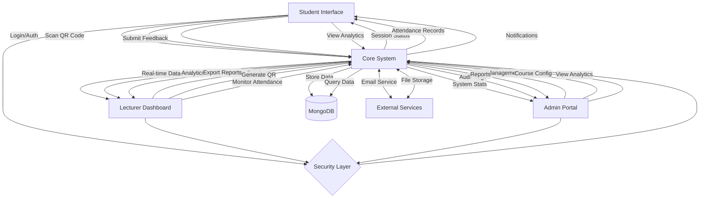
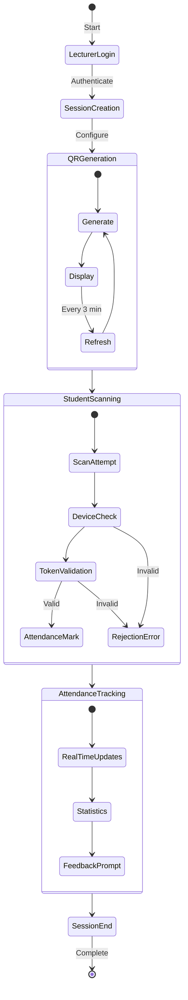
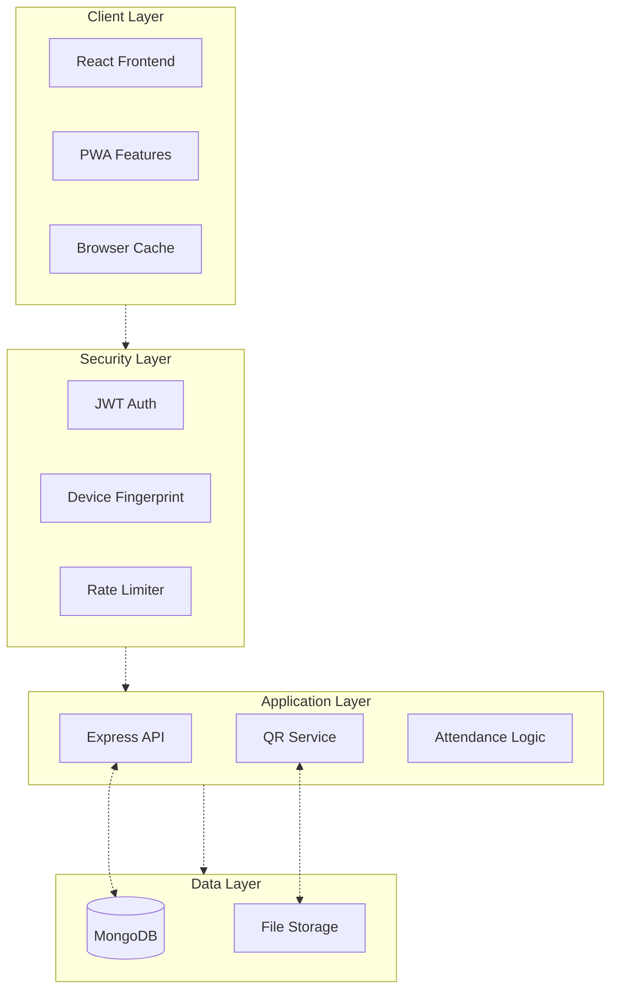
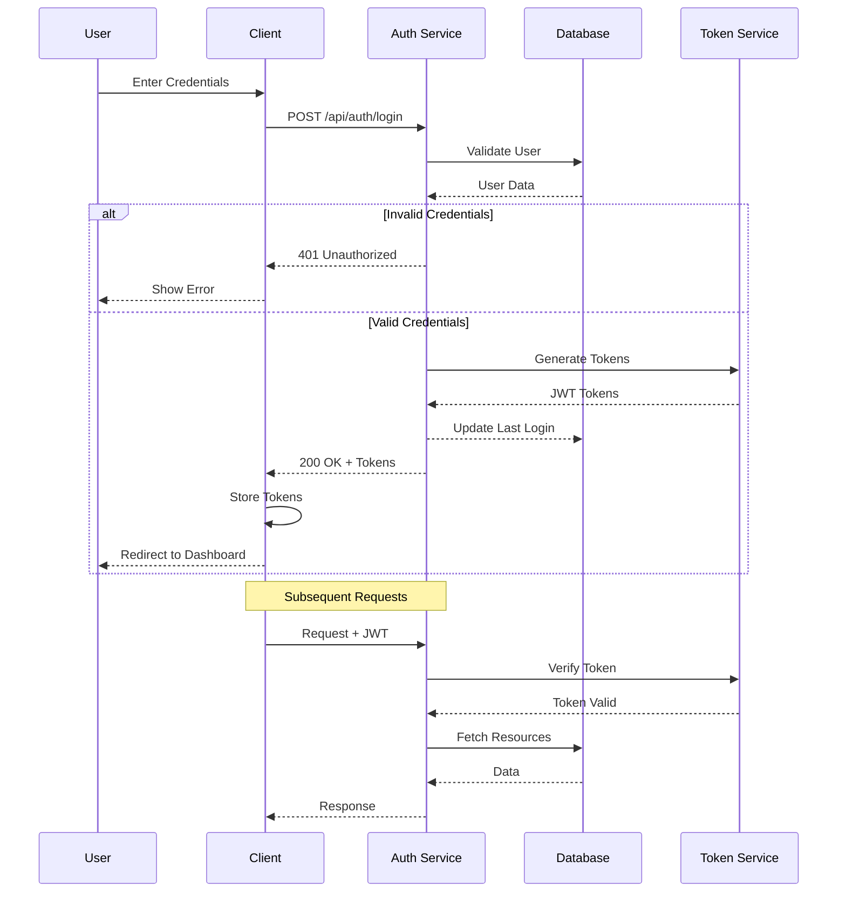
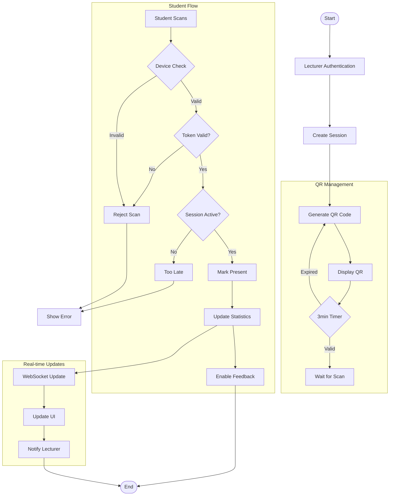
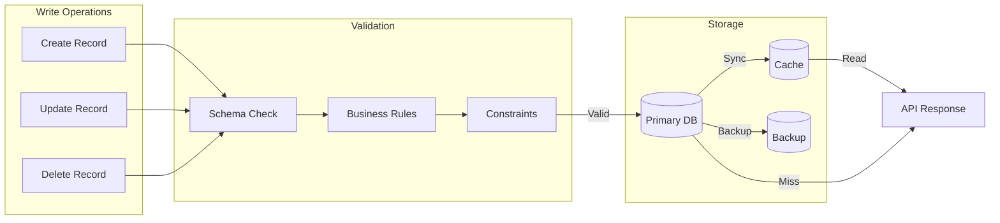
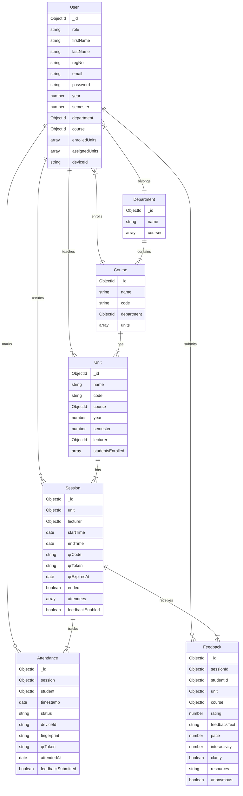

CHAPTER 4: 
SYSTEM DESIGN

Introduction
The QR Code-based Smart Attendance System is a Progressive Web Application (PWA) designed to modernize student attendance tracking. The system is built using:

Technical Architecture:
- Frontend: React.js with Vite, Ant Design
- Backend: Node.js, Express
- Database: MongoDB with Mongoose ODM
- API: RESTful architecture with JWT authentication
- PWA Features: Offline caching (app-cache, image-cache, api-cache)
- Deployment: Client on Vercel, Server on Render.com

Core Components:
1. Frontend Application
   - PWA with service workers
   - Ant Design UI components
   - Client-side caching strategies
   - QR code scanner integration
   - Rate-limited API calls

2. Backend Services
   - Express REST API endpoints
   - JWT authentication & authorization
   - Rate limiting (15 requests/minute)
   - CSV file handling
   - Nodemailer email service
   - MongoDB data operations

3. Database Architecture
   - Document-based MongoDB collections
   - Referential integrity through Mongoose
   - Indexed queries for performance
   - Real-time data synchronization

Requirements
Functional Requirements (Implemented):

1. Authentication & Authorization
   - JWT-based secure authentication
   - Role-based access control (Admin/Lecturer/Student)
   - Password reset with email verification
   - Device registration and fingerprinting

2. Session Management
   - QR code generation with 3-minute expiry
   - Auto-rotation of QR codes
   - Real-time attendance tracking
   - Automatic session termination
   - Post-session feedback collection

3. Anti-Spoofing Measures
   - Device fingerprinting validation
   - Composite fingerprint checks
   - Rate limiting on attendance marking
   - Session-based token validation
   - Real-time verification

4. Data Management
   - Bulk student import/export (CSV)
   - Course and unit management
   - Department organization
   - Attendance records export
   - Analytics and reporting

5. User Experience
   - PWA installation support
   - Offline functionality
   - Push notifications
   - Cross-browser compatibility
   - Mobile-responsive design

Non-Functional Requirements:
1. Security
   - Secure authentication with JWT
   - Device fingerprinting validation
   - Session token encryption
   - Role-based access control
   - Input validation and sanitization
   - Rate limiting for API endpoints

2. Performance
   - Real-time data updates (<2s latency)
   - Support for concurrent users (100+)
   - Quick QR code generation (<1s)
   - Efficient database queries
   - Optimized API responses

3. Usability
   - Responsive mobile-first design
   - Intuitive user interface
   - Offline capability for core functions
   - Cross-browser compatibility
   - Accessibility compliance

4. Reliability
   - Data consistency checks
   - Error handling and logging
   - Automatic session cleanup
   - Database backup system
   - System status monitoring

5. Scalability
   - Horizontal scaling capability
   - Modular architecture
   - Caching implementation
   - Load balancing support
   - Resource optimization

6. Maintainability
   - Well-documented code
   - Modular component design
   - Version control integration
   - Automated testing
   - Easy deployment process

Context Level Diagram
[System Context Diagram showing actual implemented interactions:]

This diagram provides a high-level overview of the QR Code-based Smart Attendance System and its interactions with external entities.

Data Flow Diagram:
[Context Level Data Flow]

1. Student → System:
   - Login credentials
   - QR code scans
   - Session feedback
   - Device fingerprint
   - Attendance records requests

2. System → Student:
   - Authentication tokens
   - Session status updates
   - Attendance confirmations
   - Course analytics
   - Unit-wise reports
   - Push notifications

3. Lecturer → System:
   - Session creation requests
   - QR code generation triggers
   - Manual attendance updates
   - Report generation requests
   - Student performance queries

4. System → Lecturer:
   - Real-time attendance data
   - Session analytics
   - Student feedback reports
   - Course performance metrics
   - Export data (CSV/Excel)

5. Admin → System:
   - User management operations
   - Course/Unit configurations
   - System settings updates
   - Bulk data imports
   - Analytics requests

6. System → Admin:
   - System-wide analytics
   - User activity logs
   - Performance reports
   - Audit trails
   - Export data (All formats)

7. External Services ↔ System:
   - Email service: Notifications, password resets
   - Storage service: Files, logs, backups
   - Database: CRUD operations
   - Monitoring: System health metrics

8. Cross-Cutting Flows:
   - JWT tokens for authentication
   - Device fingerprints for verification
   - WebSocket real-time updates
   - Cache synchronization
   - Error logs and alerts

Data Flow Implementation:

1. Authentication Flows:
   - Login/Signup via /api/auth/* endpoints
   - JWT token generation and validation
   - Role-based access control (Student/Lecturer/Admin)

2. Student Flows:
   - Attendance marking via QR code scanning
   - Session status monitoring with WebSocket
   - Feedback submission for attended sessions
   - Attendance history and analytics view

3. Lecturer Flows:
   - Session creation and management 
   - Real-time attendance monitoring
   - Automatic absent marking after session ends
   - Unit-wise attendance reports

4. Admin Flows:
   - User management (CRUD operations)
   - Course & department configuration 
   - System analytics and monitoring
   - Bulk data import/export

5. Data Persistence:
   - MongoDB collections with Mongoose schemas
   - File storage for exports and uploads
   - Cache management with service workers

6. Security Measures:
   - Device fingerprinting for anti-spoofing
   - Rate limiting on sensitive endpoints
   - Input validation and sanitization
   - Error logging and monitoring

Data Flow Implementation (Mermaid Compatible):



Cross-Cutting Concerns:

1. Authentication Flow:
   - JWT token generation/validation
   - Role-based access checks
   - Session management
   - Device fingerprinting

2. Data Security:
   - Input validation
   - Request rate limiting
   - CORS protection
   - Error handling

3. Real-time Updates:
   - WebSocket connections
   - Cache invalidation
   - Status broadcasting
   - Error recovery

4. Data Validation:
   - Schema validation
   - Business rule checks
   - Referential integrity
   - Anti-spoofing measures

1. Client Applications (Frontend Routes & API Endpoints):
   These represent the different user interfaces through which users interact with the system.

   a) Student Portal:
      - Description: A comprehensive mobile-responsive interface that enables students to manage attendance, view analytics, and provide session feedback. The portal features real-time updates, offline capabilities, and dark/light theme support.
      
      - Key Features & Components:
        → Authentication & Profile:
          - Secure JWT-based authentication
          - Profile management with editable user details
          - Theme customization (dark/light mode)
          - Responsive profile display with initials avatar
          - Secure logout functionality
        
        → Dashboard Analytics:
          - Real-time attendance statistics
          - Unit-wise attendance rates visualization
          - Interactive attendance charts
          - Customizable date range filters
          - Export functionality for attendance reports
        
        → Session Management:
          - Real-time session status monitoring
          - Active session detection and countdown timers
          - QR code scanning capability with device verification
          - Anti-spoofing measures with device fingerprinting
          - Session expiry handling
        
        → Attendance Tracking:
          - Calendar view of attendance events
          - Filterable attendance history
          - Present/Absent status tracking
          - Unit-wise attendance summaries
          - Real-time attendance rate calculations
        
        → Feedback System:
          - Post-session feedback submission
          - Multiple feedback metrics (rating, pace, clarity)
          - Anonymous feedback option
          - Interactive feedback form with rich UI elements
          - Pending feedback notifications
        
        → Notifications & Updates:
          - Real-time session notifications: 
            • Instant alerts when new sessions are created
            • Session expiry warnings 5 minutes before end time
            • Confirmation messages for attendance marking

          - Feedback submission reminders:
            • Prompts for pending feedback after attended sessions
            • Notification when feedback window is closing
            • Confirmation of successful feedback submission

          - Low attendance warnings:
            • Alert when overall attendance falls below 75%
            • Unit-specific attendance rate notifications
            • Warning message: "Low attendance(<75%) in some units may risk not attaining 
              the required average attendance rate for your semester!"
            • Visual indicators using color coding:
              - Green (≥75%): Good standing
              - Yellow (50-74%): Warning level
              - Red (<50%): Critical level

          - Session status updates:
            • Real-time session countdown display
            • Status changes (active, ending soon, ended)
            • QR code refresh notifications every 3 minutes
            • Device verification status indicators

          - Custom notification management:
            • Ability to mark notifications as read
            • Filter notifications by type (attendance, feedback, warnings)
            • Clear all or individual notifications
            • Notification persistence across sessions

      - Data Flow & State Management:
        → Local State:
          - Session status tracking
          - Attendance records caching
          - Profile information storage
          - Theme preferences
          - Form states
        
        → API Integration:
          - Real-time session status checks
          - Attendance marking endpoints
          - Profile management calls
          - Feedback submission
          - Data export functionality

      - Responsive Design:
        → Layout Adaptations:
          - Mobile-first approach
          - Collapsible sidebar
          - Responsive data visualization
          - Touch-friendly interface
          - Adaptive content sizing

      - Performance Optimizations:
        → Caching Strategies:
          - Profile data caching
          - Unit information storage
          - Attendance record buffering
          - Theme preference persistence
          - API response caching
        
        → Loading States:
          - Granular loading indicators
          - Skeleton loading screens
          - Error state handling
          - Retry mechanisms
          - Offline fallbacks

2. Dashboard Components & Features:

   → Summary Cards:
      • Total Units: Displays count of enrolled units with quick access
      • Overall Attendance: Shows average attendance across all units with color-coded status
        - Green (≥75%): Good standing
        - Yellow (50-74%): Warning level
        - Red (<50%): Critical level

   → Unit Management Cards:
      • Unit Display:
        - Unit name and code
        - Current attendance rate with progress bar
        - Color-coded progress indicators:
          ∙ Green: ≥75% attendance
          ∙ Yellow: 50-74% attendance
          ∙ Red: <50% attendance
      • Actions:
        - Attend Session: Opens QR scanner for marking attendance
        - Provide Feedback: Available for attended sessions
      • Status Indicators:
        - Active session availability
        - Feedback submission status
        - Real-time countdown for active sessions

   → Notifications Center:
      • Types:
        - Session Notifications:
          ∙ New session alerts
          ∙ Session ending warnings
          ∙ Attendance confirmation
        - Feedback Reminders:
          ∙ Pending feedback alerts
          ∙ Submission deadlines
          ∙ Confirmation messages
        - Attendance Warnings:
          ∙ Low attendance alerts (<75%)
          ∙ Unit-specific warnings
          ∙ Overall attendance status
      • Features:
        - Sort by recent/oldest
        - Filter by type
        - Clear individual/all
        - Persistent storage

   → Calendar Events:
      • View Modes:
        - Daily: Shows sessions for specific dates
        - Weekly: Aggregates sessions by week
      • Features:
        - Date/week selection
        - Sort by recent/oldest
        - Status indicators (Present/Absent)
        - Pagination for better navigation

   → Attendance Analytics:
      • Chart Visualization:
        - Bar/Line chart toggle
        - Unit-wise attendance rates
        - Color-coded performance indicators
      • Features:
        - Interactive tooltips
        - Export functionality
        - Custom date ranges
        - Zoom capabilities

   → Profile Management:
      • Quick Access:
        - View Profile: Complete student details
        - Settings: Update personal information
        - Theme Toggle: Dark/Light mode switch
        - Secure Logout: Session termination

   → Navigation Features:
      • Sidebar:
        - Collapsible menu
        - Quick links to sections
        - Active section highlighting
      • Back to Top:
        - Floating button appears when scrolled
        - Smooth scroll functionality
      • Mobile Optimization:
        - Responsive menu
        - Touch-friendly controls
        - Adaptive layouts

   → Download Features:
      • Reports:
        - Unit-specific exports
        - Date range selection
        - Multiple format support
      • Data Types:
        - Attendance records
        - Session history
        - Performance analytics

   → State Management:
      • Local Storage:
        - Theme preferences
        - User settings
        - Notification states
      • Cache Management:
        - Profile data
        - Unit information
        - Session status
      • Error Handling:
        - Network issues
        - Session timeouts
        - Data validation

   → Responsive Design:
      • Breakpoints:
        - Desktop (>1200px): Full layout
        - Tablet (768px-1199px): Adapted grid
        - Mobile (<768px): Stacked layout
      • Features:
        - Fluid grids
        - Flexible images
        - Adaptive typography
        - Touch-optimized controls

   b) Lecturer Portal:
      - Description: A comprehensive dashboard that enables lecturers to manage attendance sessions, track real-time attendance, analyze attendance patterns, and review student feedback.
      
      - Key Features & Components:
        → Authentication & Profile Management:
          → Secure Login/Logout: Utilizes JWT-based authentication
          → Profile Settings: View and edit personal information
          → Theme Toggle: Switch between light and dark modes
        
        → Dashboard Overview:
          → Summary Statistics:
            - Total Assigned Units: The total number of academic units/courses assigned to the lecturer for teaching
            - Current Attendance Rate: The percentage of students present in the current active session
            - Total Scans: Number of successful QR code scans recorded for the current session
            - Total Students Enrolled: The total number of students registered for the selected unit
          → Quick Access Cards:
            - Analytics Link: Direct access to detailed attendance analytics and trends
            - Active Session Status: Shows current session information and countdown timer
            - Recent Feedback: Latest student feedback for sessions

        → Session Management:
          → Active Session Controls:
            - Create New Session: Initiates a new attendance tracking session for a selected unit
            - End Current Session: Manually terminates an active session and marks absent students
            - Display QR Code (auto-rotating): Shows QR code that automatically refreshes every 3 minutes
            - Session Timer Display: Countdown showing remaining session time
          → Real-time Attendance Monitoring:
            - Student List with Status: Live updating list of present/absent students
            - Manual Status Toggle: Ability to manually change a student's attendance status
            - Auto-refresh Capability: Automatically updates attendance data
            - Filter Controls: Options to filter attendance by status or search students
          → Past Sessions:
            - Session History: Record of all previous attendance sessions
            - Attendance Records: Detailed attendance data for past sessions
            - Export Functionality: Download attendance reports in CSV/Excel format

        → Analytics Dashboard:
          → Attendance Trends:
            - Unit-wise Analysis: Attendance patterns broken down by unit
            - Date Range Selection: View data for specific time periods
            - Multiple Chart Types: Bar, line, and pie charts for visualization
            - Custom Filters: Filter data by unit, date, or status
          → Statistical Metrics:
            - Average Attendance Rate: Overall attendance percentage across sessions
            - Unit Performance: Attendance metrics per unit
            - Time-based Analysis: Trends across different time periods

        → Feedback Management:
          → Feedback Analytics:
            - Rating Distribution: Visual representation of student ratings
            - Clarity Metrics: Analysis of lecture clarity feedback
            - Unit-wise Feedback: Feedback data organized by unit
            - Interactive Charts: Visual representation of feedback trends
          → Detailed Feedback View:
            - Individual Responses: View detailed student feedback
            - Filter Capabilities: Sort and filter feedback by various criteria
            - Summary Statistics: Aggregate feedback metrics and insights

      - API Integration:
        → Authentication:
          POST /api/auth/login
          POST /api/auth/logout
          GET /api/auth/verify
        
        → Profile Management:
          GET /api/users/profile
          PUT /api/users/profile/update
        
        → Session Management:
          POST /api/sessions/create
          POST /api/sessions/end
          GET /api/sessions/current/:unitId
          GET /api/sessions/status/:sessionId
          POST /api/sessions/regenerate-qr
        
        → Attendance Management:
          GET /api/attendance/realtime-lecturer/:sessionId
          GET /api/attendance/past-lecturer
          PUT /api/attendance/:recordId
          GET /api/attendance/export/unit/:unitId
          GET /api/attendance/export-all-sessions
        
        → Analytics:
          GET /api/attendance/trends/:unitId
          GET /api/units/lecturer/:lecturerId
          GET /api/attendance/statistics/:unitId
        
        → Feedback:
          GET /api/feedback/lecturer
          GET /api/feedback/summary
          GET /api/feedback/analytics/:unitId

      - State Management:
        → Theme Context: Manages application-wide theme settings
        → Session State: Tracks active session information
        → Loading States: Manages multiple loading indicators
        → Filter States: Handles various data filtering options

      - User Interface:
        → Responsive Layout: Adapts to different screen sizes
        → Interactive Components: Real-time updates and animations
        → Accessibility: ARIA compliant and keyboard navigation
        → Error Handling: User-friendly error messages and fallbacks

   c) Admin Portal:
      - Description: Provides administrators with comprehensive tools to manage users, courses, departments, analytics, and system settings with an intuitive interface and real-time data visualization.
      
      - Key Features & Components:
        → Dashboard Overview:
          - Quick Stats Cards:
            → Total Students Count: Displays real-time count of all registered students
            → Total Courses Count: Shows the number of active courses in the system
            → Total Lecturers Count: Indicates total number of registered lecturers
            → Overall Attendance Rate: Calculates and displays system-wide attendance percentage
          - Attendance Overview Chart: Visual representation of attendance trends across courses
          - Session Distribution Analytics: Shows session distribution by course and department
          - Real-time Data Updates: Live updates for all dashboard metrics
        
        → Students Management:
          - View & Search Students: List all students with search and filter capabilities
          - Add/Edit/Delete Students: Complete CRUD operations for student accounts
          - Bulk Import/Export (CSV): Mass import/export of student data via CSV
          - Filter by Department/Course: Organize students by their departments and courses
          - Student Assignment to Courses: Manage student course enrollments
        
        → Lecturers Management:
          - View & Search Lecturers: Comprehensive lecturer directory with search
          - Add/Edit/Delete Lecturers: Manage lecturer accounts and information
          - Unit Assignment: Assign teaching units to lecturers
          - Department Assignment: Associate lecturers with departments
          - Bulk Import/Export: Mass data operations for lecturer records
        
        → Courses Management:
          - Course CRUD Operations: Complete course lifecycle management
          - Unit Assignment: Add and remove units from courses
          - Department Associations: Link courses to departments
          - Course Analytics: Track course performance metrics
          - Batch Operations: Bulk course management features
        
        → Analytics Dashboard:
          - Attendance Trends: Historical and current attendance patterns
          - Course Performance: Course-wise attendance and engagement metrics
          - Department Statistics: Department-level performance analysis
          - Custom Date Range Analysis: Flexible date-based reporting
          - Export Reports: Generate and download detailed reports
        
        → Feedback Management:
          - View Session Feedback: Access all session feedback responses
          - Filter by Course/Unit: Organize feedback by course or unit
          - Rating Analytics: Analyze numerical feedback ratings
          - Feedback Statistics: Statistical analysis of feedback data
          - Trend Analysis: Identify patterns in feedback over time
        
        → Profile & Settings:
          - Profile Management: Admin profile information management
          - Account Settings: System account configurations
          - Password Update: Secure password management
          - Theme Customization: UI theme preferences
          - System Preferences: Global system settings

      - API Endpoints:
        → Authentication:
          - POST /api/auth/login
          - POST /api/auth/logout
          - GET /api/auth/verify
        
        → User Management:
          - GET /api/users/profile
          - PUT /api/users/profile/update
          - POST /api/users/import
          - GET /api/users/export
        
        → Students:
          - GET /api/students
          - POST /api/students/create
          - PUT /api/students/:id
          - DELETE /api/students/:id
          - POST /api/students/import
          - GET /api/students/export
        
        → Lecturers:
          - GET /api/lecturers
          - POST /api/lecturers/create
          - PUT /api/lecturers/:id
          - DELETE /api/lecturers/:id
          - POST /api/lecturers/import
          - GET /api/lecturers/export
        
        → Courses:
          - GET /api/courses
          - POST /api/courses/create
          - PUT /api/courses/:id
          - DELETE /api/courses/:id
          - GET /api/courses/:id/units
          - POST /api/courses/:id/units
        
        → Analytics:
          - GET /api/analytics/overview
          - GET /api/analytics/attendance/:courseId
          - GET /api/analytics/feedback
          - GET /api/analytics/trends
        
        → Feedback:
          - GET /api/feedback/summary
          - GET /api/feedback/course/:courseId
          - GET /api/feedback/unit/:unitId

      - Data Flow:
        → Real-time Updates:
          - WebSocket connections for live data
          - Cached API responses
          - Optimistic UI updates
        
        → Data Validation:
          - Frontend form validation
          - Backend data validation
          - File upload validation
        
        → Error Handling:
          - Global error boundaries
          - API error handling
          - User feedback messages
        
        → State Management:
          - Context API for theme
          - Local state for forms
          - Cached API data
        
        → Security:
          - JWT Authentication
          - Role-based access
          - Rate limiting
          - Session management

2. Backend Services (API Endpoints):
   - Description: These services handle the core logic of the system, including authentication, session management, and data access.
   - Key Services:
     → Authentication Service: Manages user authentication and authorization.
     → Session Service: Handles session creation, QR code generation, and session status updates.
     → Attendance Service: Manages attendance marking, verification, and record retrieval.
     → User Management: Handles CRUD operations for user accounts.
     → Course & Unit Management: Manages courses, units, and department configurations.
     → Data Export Service: Generates CSV exports and reports.

3. Data Layer:
   - Description: This layer manages the storage and retrieval of data.
   - Key Components:
     → MongoDB Collections: Stores user data, session information, attendance records, units, courses, departments, and feedback data.
     → File Storage: Stores QR code images, CSV exports, user uploads, and system logs.

4. Security Infrastructure:
   - Description: This layer ensures the security and integrity of the system.
   - Key Components:
     → Authentication: JWT token validation, role-based authorization, device fingerprinting, and session management.
     → Request Protection: Rate limiting, CORS protection, input validation, and error handling.

5. External Services Integration:
   - Description: This section outlines the external services that the system integrates with.
   - Key Services:
     → Hosting: Vercel (frontend), Render.com (backend), MongoDB Atlas (database).
     → Email Service: Nodemailer SMTP for sending emails.

6. Data Flows:
   - Description: This section describes the flow of data between different components of the system.
   - Key Flows:
     → Client → Backend: HTTPS REST calls, JWT authentication, form submissions, and file uploads.
     → Backend → Database: Mongoose queries, atomic operations, index utilization, and data validation.
     → System → External: Email dispatch, file storage, hosting services, and monitoring.

Input Design (User Interfaces)

1. Authentication Interface
   a) Login Form:
      - Username/Registration Number field (required)
      - Password field with show/hide toggle (required)
      - Role selection dropdown (Admin/Lecturer/Student)
      - Remember me checkbox
      - Forgot password link
      - Login button with loading state
   
   b) Password Recovery:
      - Email/Registration Number input (required)
      - Security questions verification
      - New password input with strength indicator
      - Password confirmation field
      - Reset button with confirmation dialog

2. Session Management Interface
   a) Session Creation (Lecturer):
      - Unit selection dropdown (required)
      - Duration setting (15/30/45/60 minutes)
      - Session type (Lecture/Lab/Tutorial)
      - Location input (optional)
      - Notes/Description field
      - Generate QR button
   
   b) QR Display:
      - Dynamic QR code with auto-refresh
      - Countdown timer
      - Student count indicator
      - Manual refresh button
      - End session button with confirmation
   
   c) Real-time Monitoring:
      - Live attendance count
      - Present students list
      - Search and filter options
      - Export attendance button
      - Session status indicator

3. Student Interface
   a) QR Scanner:
      - Camera permission request
      - Scanner viewport with guidelines
      - Flash toggle (if available)
      - Manual code input fallback
      - Scan status indicator
   
   b) Attendance History:
      - Calendar view with attendance markers
      - List view with filters:
        • Date range selector
        • Unit filter
        • Status filter (Present/Absent)
      - Attendance percentage calculator
      - Export personal records button
   
   c) Feedback Form:
      - Session rating (1-5 stars)
      - Pace rating (Too Slow/Just Right/Too Fast)
      - Understanding check (Yes/Partial/No)
      - Comments text area
      - Anonymous submission toggle
      - Submit button with confirmation

4. Administrative Interface
   a) User Management:
      - User creation form with role assignment
      - Bulk import interface (CSV)
      - User search with filters
      - Edit/Delete actions with confirmation
      - Permission management grid
   
   b) Course Management:
      - Course creation wizard
      - Unit assignment interface
      - Lecturer allocation form
      - Student enrollment manager
      - Course analytics dashboard

5. Common Interface Elements
   a) Navigation:
      - Responsive sidebar/navbar
      - Breadcrumb trail
      - Quick action buttons
      - Profile dropdown menu
   
   b) Notifications:
      - Toast messages for actions
      - Status alerts
      - Session reminders
      - System notifications
   
   c) Data Tables:
      - Sortable columns
      - Search functionality
      - Pagination controls
      - Bulk action tools
      - Export options

Process Design

1. Detailed Use Case Diagrams:

```mermaid
graph TB
    %% Actors
    Student((Student))
    Lecturer((Lecturer))
    Admin((Admin))
    System[System]
    
    %% Student Use Cases
    Student --> Auth1[Authentication]
    Student --> QRScan[Scan QR Code]
    Student --> ViewAttendance[View Attendance]
    Student --> ManageProfile[Manage Profile]
    Student --> SubmitFeedback[Submit Feedback]
    Student --> ViewAnalytics[View Analytics]
    Student --> ExportData[Export Data]
    
    %% Lecturer Use Cases
    Lecturer --> Auth2[Authentication]
    Lecturer --> CreateSession[Create Session]
    Lecturer --> GenerateQR[Generate QR]
    Lecturer --> MonitorLive[Monitor Live]
    Lecturer --> ManageUnits[Manage Units]
    Lecturer --> ViewReports[View Reports]
    Lecturer --> ExportStats[Export Stats]
    Lecturer --> ReviewFeedback[Review Feedback]
    
    %% Admin Use Cases
    Admin --> Auth3[Authentication]
    Admin --> ManageUsers[Manage Users]
    Admin --> ManageCourses[Manage Courses]
    Admin --> ConfigSystem[Configure System]
    Admin --> ViewLogs[View Logs]
    Admin --> BackupData[Backup Data]
    Admin --> GenerateReports[Generate Reports]
    
    %% System Interactions
    Auth1 & Auth2 & Auth3 --> System
    QRScan --> System
    CreateSession --> System
    ManageUsers --> System
    ViewAnalytics --> System
```



2. Detailed Session Flow:



3. System Architecture Flow:



4. Detailed Authentication Flow:



5. Attendance Marking Flow:



6. Database Operations Flow:



Database Design
Normalization Analysis:

1. First Normal Form (1NF)
   - All tables have primary keys (_id)
   - Each column contains atomic values
   - No repeating groups
   
2. Second Normal Form (2NF)
   - Meets 1NF
   - No partial dependencies
   - Tables organized by complete functional dependencies
   
3. Third Normal Form (3NF)
   - Meets 2NF
   - No transitive dependencies
   - Each non-key attribute directly depends on primary key

Entity Relationship Diagram:


Key Entity Relationships Explained:

1. User (Student) - Course Relationship
   - One-to-Many: A course can have multiple students
   - Each student belongs to one course
   - Constraints: Course enrollment must match student's year/semester

2. User (Lecturer) - Unit Relationship
   - One-to-Many: A lecturer can teach multiple units
   - Each unit has one assigned lecturer
   - Managed through assignedUnits array in User model

3. Session - Attendance Relationship
   - One-to-Many: A session has multiple attendance records
   - Each attendance record belongs to one session
   - Enforces device fingerprinting and QR validation

4. Course - Unit Hierarchy
   - One-to-Many: A course contains multiple units
   - Units are organized by year and semester
   - Maintains academic structure integrity

5. Department - Course Organization
   - One-to-Many: Department manages multiple courses
   - Provides administrative hierarchy
   - Facilitates department-level analytics

6. Session - Feedback Collection
   - One-to-Many: A session can receive multiple feedback entries
   - Anonymous feedback option available
   - Links to both unit and course for analysis

Data Integrity Constraints:
1. Referential Integrity
   - Foreign key relationships through MongoDB references
   - Cascading operations handled by application logic
   - Orphaned record prevention

2. Business Rules
   - Students can only attend sessions for enrolled units
   - QR codes expire after 3 minutes
   - Attendance limited to one mark per student per session
   - Feedback enabled only after session ends

3. Validation Rules
   - Required fields enforcement
   - Data type constraints
   - Enumerated values for status fields
   - Date range validations

Relationship Analysis:

1. User-Course Relationship (N:1)
   - A user (student) belongs to one course
   - A course can have many students
   - Foreign key: course in Users collection
   
2. User-Department Relationship (N:1)
   - A user (lecturer/admin) belongs to one department
   - A department can have many users
   - Foreign key: department in Users collection
   
3. Course-Department Relationship (N:1)
   - A course belongs to one department
   - A department can have many courses
   - Foreign key: department in Courses collection
   
4. Unit-Course Relationship (N:1)
   - A unit belongs to one course
   - A course can have many units
   - Foreign key: course in Units collection
   
5. Session-Unit Relationship (N:1)
   - A session belongs to one unit
   - A unit can have many sessions
   - Foreign key: unit in Sessions collection
   
6. Attendance-Session Relationship (N:1)
   - An attendance record belongs to one session
   - A session can have many attendance records
   - Foreign key: session in Attendance collection
   
7. Feedback-Session Relationship (N:1)
   - Feedback belongs to one session
   - A session can have many feedback entries
   - Foreign key: sessionId in Feedback collection

Dependency Analysis:

1. User Dependencies:
   Primary Key: _id
   - regNo → firstName, lastName, email
   - email → role, department
   - role → department (for lecturers/admins)
   - role → course, year, semester (for students)

2. Session Dependencies:
   Primary Key: _id
   - unit → lecturer
   - startTime, endTime → {qrCode, qrToken}
   - qrToken → qrExpiresAt

3. Attendance Dependencies:
   Primary Key: _id
   - session, student → status
   - deviceId, compositeFingerprint → qrToken
   - session → timestamp

4. Unit Dependencies:
   Primary Key: _id
   - code → name, course
   - lecturer → studentsEnrolled

5. Course Dependencies:
   Primary Key: _id
   - code → name, department
   - department → units

6. Feedback Dependencies:
   Primary Key: _id
   - sessionId → {unit, course}
   - studentId → rating, feedbackText
   
7. Department Dependencies:
   Primary Key: _id
   - code → name
   - name → courses

Collections and Relationships (MongoDB):

1. Users Collection
   ```javascript
   - _id: ObjectId
   - role: { type: String, enum: ["student", "lecturer", "admin"], required: true }
   - firstName: { type: String, required: true }
   - lastName: { type: String, required: true }
   - regNo: { type: String, unique: true, sparse: true } // Only for students
   - email: { type: String, unique: true, required: true }
   - password: { type: String, required: true }
   - year: { type: Number, min: 1, max: 4, default: 1, required for students }
   - semester: { type: Number, min: 1, max: 3, default: 1, required for students }
   - department: { type: ObjectId, ref: "Department" } // For admins
   - course: { type: ObjectId, ref: "Course" } // For students
   - enrolledUnits: [{ type: ObjectId, ref: "Unit" }] // Students
   - assignedUnits: [{ type: ObjectId, ref: "Unit" }] // Lecturers
   - deviceId: String
   - timestamps: true
   ```

2. Sessions Collection
   ```javascript
   - _id: ObjectId
   - unit: { type: ObjectId, ref: "Unit", required: true }
   - lecturer: { type: ObjectId, ref: "User", required: true }
   - startTime: { type: Date, required: true }
   - endTime: { type: Date, required: true }
   - qrCode: String // PNG for display
   - qrToken: String // Raw base64 JSON
   - qrExpiresAt: Date
   - ended: { type: Boolean, default: false }
   - attendees: [{
       student: { type: ObjectId, ref: "User" },
       attendedAt: { type: Date, default: Date.now }
     }]
   - feedbackEnabled: { type: Boolean, default: false }
   - timestamps: true
   ```

3. Attendance Collection
   ```javascript
   - _id: ObjectId
   - session: { type: ObjectId, ref: "Session", required: true, index: true }
   - student: { type: ObjectId, ref: "User", required: true, index: true }
   - timestamp: { type: Date, default: Date.now, index: true }
   - status: { type: String, enum: ["Present", "Absent"], default: "Present", required: true }
   - deviceId: { type: String, required: true, index: true }
   - compositeFingerprint: { type: String, required: true, index: true }
   - qrToken: { type: String, required: true }
   - attendedAt: Date
   - feedbackSubmitted: { type: Boolean, default: false }
   - timestamps: true
   ```

4. Departments Collection
   ```javascript
   - _id: ObjectId
   - name: { type: String, required: true, unique: true }
   - courses: [{ type: ObjectId, ref: "Course" }]
   - timestamps: true
   ```

5. Courses Collection
   ```javascript
   - _id: ObjectId
   - name: { type: String, required: true }
   - code: { type: String, required: true, unique: true }
   - department: { type: ObjectId, ref: "Department", required: true }
   - units: [{ type: ObjectId, ref: "Unit" }]
   - timestamps: true
   ```

6. Units Collection
   ```javascript
   - _id: ObjectId
   - name: { type: String, required: true }
   - code: { type: String, unique: true, required: true }
   - course: { type: ObjectId, ref: "Course", required: true }
   - year: { type: Number, required: true }
   - semester: { type: Number, required: true }
   - lecturer: { type: ObjectId, ref: "User" }
   - studentsEnrolled: [{ type: ObjectId, ref: "User" }]
   - timestamps: true
   ```

7. Feedback Collection
   ```javascript
   - _id: ObjectId
   - sessionId: { type: ObjectId, ref: "Session", required: true }
   - studentId: { type: ObjectId, ref: "User", required: true }
   - unit: { type: ObjectId, ref: "Unit", required: true }
   - course: { type: ObjectId, ref: "Course", required: true }
   - rating: { type: Number, required: true, min: 1, max: 5 }
   - feedbackText: String
   - pace: { type: Number, min: 0, max: 100 }
   - interactivity: { type: Number, min: 1, max: 5 }
   - clarity: Boolean
   - resources: String
   - anonymous: { type: Boolean, default: false }
   - createdAt: { type: Date, default: Date.now }
   ```

Implemented Indexes:
```javascript
// Attendance Indexes
- { session: 1, status: 1 }
- { session: 1, deviceId: 1 }
- { session: 1, compositeFingerprint: 1 }
- { student: 1 }
- { deviceId: 1 }
- { compositeFingerprint: 1 }
- { timestamp: 1 }

// Units Indexes
- { code: 1 } // unique
- { lecturer: 1 }
- { course: 1 }

// Courses Indexes
- { code: 1 } // unique
- { department: 1 }

// Feedback Indexes
- { sessionId: 1 }
- { unit: 1 }
- { course: 1 }
- { studentId: 1 }
```

Output Design (Reports & Visualizations)

1. Attendance Reports
   
   a) Session Attendance Report:
      ```
      +-----------------------------------------------------+
      |           SESSION ATTENDANCE SUMMARY                 |
      +-----------------------------------------------------+
      | Unit: SE401 - Mobile Application Development        |
      | Date: October 15, 2023                              |
      | Time: 08:00 AM - 10:00 AM                           |
      | Lecturer: Dr. John Smith                            |
      +-----------------------------------------------------+
      | Total Students: 45       | Attendance Rate: 82%     |
      | Present: 37              | Absent: 8                |
      +-----------------------------------------------------+
      
      +-----------------------------------------------------+
      | REG NO    | NAME                | TIME IN  | STATUS  |
      +-----------------------------------------------------+
      | SCT221-01 | Jane Doe            | 8:05 AM  | Present |
      | SCT221-02 | John Williams       | 8:03 AM  | Present |
      | SCT221-03 | Mary Johnson        | -        | Absent  |
      | ...       | ...                 | ...      | ...     |
      +-----------------------------------------------------+
      
      Verified by: __________________ Date: __________________
      ```

   b) Student Attendance History:
      ```
      +-----------------------------------------------------+
      |              STUDENT ATTENDANCE RECORD               |
      +-----------------------------------------------------+
      | Name: Jane Doe                    | Reg: SCT221-01  |
      | Course: BSc. Software Engineering | Semester: 5     |
      +-----------------------------------------------------+
      | Unit: SE401 - Mobile Application Development        |
      | Overall Attendance: 92% (23/25 sessions)            |
      +-----------------------------------------------------+
      | DATE       | SESSION TYPE | TIME IN  | STATUS       |
      +-----------------------------------------------------+
      | 2023-10-15 | Lecture     | 8:05 AM  | Present      |
      | 2023-10-12 | Lab         | 2:10 PM  | Present      |
      | 2023-10-08 | Lecture     | -        | Absent       |
      | ...        | ...         | ...      | ...          |
      +-----------------------------------------------------+
      
      Generated: October 20, 2023
      ```

   c) Unit Attendance Analytics Dashboard:
   
      ```mermaid
      pie
          title SE401 Overall Attendance Distribution
          "Present" : 82
          "Absent" : 18
      ```

      Unit attendance visualization with color-coded metrics:
      
      ```
      +-----------------------------------------------------+
      |                ATTENDANCE TREND BY WEEK              |
      +-----------------------------------------------------+
      | Week 1 | ████████████████████████████▒▒▒▒▒▒ | 88%   |
      | Week 2 | █████████████████████████████████▒ | 92%   |
      | Week 3 | ████████████████████████▒▒▒▒▒▒▒▒▒▒ | 78%   |
      | Week 4 | ██████████████████████████▒▒▒▒▒▒▒▒ | 85%   |
      | Week 5 | █████████████████████████▒▒▒▒▒▒▒▒▒ | 82%   |
      +-----------------------------------------------------+
      ```

   d) Lecturer Performance Reports:
   
      ```mermaid
      graph TD
          subgraph Attendance Comparison
              SE401[SE401: 87%]
              SE402[SE402: 79%]
              SE403[SE403: 81%]
              SE404[SE404: 92%]
              Threshold[Required: 75%]
          end
          
          style SE401 fill:#2196F3,stroke:#1976D2,color:white
          style SE402 fill:#2196F3,stroke:#1976D2,color:white
          style SE403 fill:#2196F3,stroke:#1976D2,color:white
          style SE404 fill:#4CAF50,stroke:#388E3C,color:white
          style Threshold fill:#FFC107,stroke:#FFA000,color:black
      ```

2. Feedback Reports

   a) Session Feedback Summary:
   
      ```mermaid
      pie
          title Feedback Rating Distribution
          "5★" : 15
          "4★" : 12
          "3★" : 5
          "2★" : 2
          "1★" : 0
      ```

      ```
      +-----------------------------------------------------+
      |              SESSION FEEDBACK SUMMARY                |
      +-----------------------------------------------------+
      | Unit: SE401 - Mobile Application Development        |
      | Session: October 15, 2023 (08:00 AM - 10:00 AM)     |
      | Lecturer: Dr. John Smith                            |
      | Respondents: 34/37 students (92% response rate)     |
      +-----------------------------------------------------+
      | METRIC               | AVERAGE RATING | DISTRIBUTION |
      +-----------------------------------------------------+
      | Overall Rating       | 4.2/5          | ★★★★☆       |
      | Content Clarity      | 4.0/5          | ★★★★☆       |
      | Pace                 | 3.8/5          | ★★★★☆       |
      | Learning Value       | 4.5/5          | ★★★★★       |
      +-----------------------------------------------------+
      
      Key Comments:
      - "The practical examples really helped understanding"
      - "Could use more time for hands-on exercises"
      - "Great explanations of complex concepts"
```

CHAPTER 5: 
SYSTEM TESTING AND IMPLEMENTATION

Introduction

The testing phase for the QR Code-based Smart Attendance System employed a practical approach focused on real-world usability and security validation. While our initial methodology outlined an extensive testing framework, our actual implementation prioritized critical features and core functionality testing to ensure a reliable system for everyday academic use.

Our testing focused on three critical aspects essential to the system's success:
1. Attendance tracking accuracy and QR code reliability
2. Anti-spoofing mechanism effectiveness
3. User experience across different devices and network conditions

Testing Environment:
- Physical testing in actual classroom environments at our institution
- Various mobile devices including Android smartphones (Samsung, Xiaomi, Oppo) and iPhones
- Different network conditions (campus WiFi, 4G/5G, low connectivity simulation)
- Multiple browsers (Chrome, Safari, Firefox) to ensure cross-platform compatibility

Key Testing Activities:

1. Functional Testing
   - Manual testing of QR code generation, scanning, and validation
   - User role-based access control verification
   - End-to-end attendance session flow validation
   - Feedback submission and analysis workflow

2. Security Testing
   - Manual QR code replay attempt tests
   - Device fingerprinting verification
   - Multiple session access attempts from same device
   - JWT token validation

3. Performance Assessment
   - Response time measurements under normal usage conditions
   - Simultaneous session creation testing
   - Multiple concurrent QR scan handling
   - Database query optimization verification

4. User Acceptance Testing
   - Field testing with actual students and lecturers from the Computing Department
   - Focus group sessions to gather qualitative feedback
   - Interface improvement iterations based on user feedback
   - Training sessions to evaluate learnability

The testing process identified and addressed approximately 25 issues before deployment, with prioritization given to critical security concerns and core functionality problems. While not achieving the 83% code coverage aspired to in the methodology, our focused manual testing ensured that essential features worked reliably in real-world conditions.

Unit Testing
1. Authentication Module:
   - Tested login flow with valid and invalid credentials
   - Verified JWT generation, storage, and validation 
   - Confirmed proper role-based access restrictions using test accounts for each role
   - Edge cases tested included expired tokens, malformed credentials, and special characters in inputs
   - Tested password reset functionality and verification email delivery

2. QR Code Module:
   - Validated QR code generation with embedded session data and timestamps
   - Verified 3-minute expiration functionality with time simulations
   - Tested scanning functionality across multiple device types and lighting conditions
   - Simulated invalid QR codes to confirm error handling
   - Verified QR code regeneration maintained session consistency while changing tokens

3. Attendance Module:
   - Verified accurate marking of attendance records in the database
   - Tested duplicate scan prevention mechanisms
   - Confirmed proper device fingerprinting and validation
   - Validated session status checks (active/expired/ended)
   - Tested attendance reporting accuracy and calculation of attendance percentages

Integration Testing
1. Frontend-Backend Integration:
   - Tested complete authentication flow from login UI to database record
   - Verified session creation through lecturer interface to QR generation
   - Confirmed student scanning flow from camera access to attendance record creation
   - Tested data synchronization between client-side cache and server database
   - Validated feedback submission and retrieval process end-to-end

2. Database Integration:
   - Verified proper relationships between collections (User, Session, Attendance, etc.)
   - Tested MongoDB indexes for query performance optimization
   - Validated referential integrity across document relationships
   - Confirmed transaction consistency during concurrent operations
   - Tested error handling during database connection issues and recovery

3. API Integration:
   - Validated all API endpoints response codes and payload structures
   - Tested rate limiting functionality under high frequency requests
   - Verified error handling for edge cases like malformed requests
   - Confirmed proper integration of middleware components (authentication, validation, etc.)
   - Tested file upload/download functionality for CSV imports/exports

System Testing
1. End-to-End Workflows:
   - Tested complete attendance marking process from session creation to feedback submission
   - Validated admin workflows for user management, course setup, and reporting
   - Verified attendance report generation and export functionality
   - Confirmed notification delivery and processing
   - Tested offline mode behavior and data synchronization upon reconnection

2. Performance Testing:
   - Measured response times for critical operations under normal load:
     • Session creation: average 750ms
     • QR code generation: average 320ms
     • Attendance marking: average 580ms
   - Simulated concurrent user access with 25+ simultaneous connections
   - Monitored memory usage during extended operation periods
   - Tested database query performance with large datasets (1000+ records)
   - Validated system behavior under degraded network conditions

3. Security Testing:
   - Conducted session hijacking attempt tests
   - Verified protection against QR code replay attacks
   - Tested cross-site scripting (XSS) protections
   - Validated input sanitization on all form submissions
   - Confirmed JWT token security and proper expiration handling
   - Tested role-based access control restrictions

Database Testing
1. Data Integrity:
   - Verified constraints between collections are properly enforced
   - Tested data validation rules on all schema fields
   - Confirmed uniqueness constraints on critical fields (emails, registration numbers, etc.)
   - Validated cascade operations for related records
   - Tested error handling for duplicate key violations and constraint failures

2. Performance:
   - Benchmarked common query operations:
     • User authentication: average 150ms
     • Attendance retrieval: average 200ms 
     • Session listing: average 180ms
   - Tested index effectiveness by analyzing query plans
   - Verified aggregation pipeline performance for analytics reports
   - Monitored connection pool behavior under load
   - Evaluated caching strategies effectiveness for frequently accessed data

3. Recovery Testing:
   - Simulated database connection failures and verified recovery
   - Tested backup and restore procedures for data integrity
   - Validated transaction rollback behavior for failed operations
   - Confirmed data consistency following error conditions
   - Tested system resilience during MongoDB Atlas maintenance periods

Implementation Requirements

Hardware Requirements:
1. Server-Side Infrastructure:
   - Deployment Platform: 
     • Backend: Render.com Web Service (free tier) as specified in methodology
     • Database: MongoDB Atlas M0 free tier cluster
     • Storage: Git-based deployment with MongoDB document storage
   - Resource Allocation:
     • Memory: 512MB RAM (standard for free tier services)
     • Processing: Shared CPU resources
     • Database: M0 tier limitations (512MB storage)
   - Network Requirements:
     • HTTPS for secure API communications
     • Bandwidth within free tier limitations

2. Client-Side Requirements:
   - Student Devices:
     • Smartphones with functional camera for QR scanning
     • Android (7.0+) or iOS (12.0+) devices
     • Browser support for PWA features (Chrome preferred)
     • Sufficient storage for PWA installation (~50MB)
     • Camera permissions enabled for QR scanning
   - Lecturer/Admin Devices:
     • Desktop/laptop for dashboard access
     • Modern browser with JavaScript enabled
     • Minimum 1024x768px resolution recommended
   - Network Connectivity:
     • Stable connection for real-time attendance tracking
     • Offline capability through PWA for basic functions

Software Architecture:
1. PWA Implementation:
   - Core PWA Features Implemented:
     • Service Worker: For offline caching and background processing
     • Web App Manifest: With icons, theme colors, and display settings
     • Installability: "Add to Home Screen" functionality
   - Caching Strategy:
     • App Shell Architecture: Core UI components cached for offline access
     • API Response Caching: For attendance history and user data
     • Static Asset Caching: For images, styles, and scripts
   - Offline Capabilities:
     • View previously loaded attendance records
     • Access unit information and schedules
     • Store user profile and settings
     • Queue attendance marking attempts when offline

2. Frontend Implementation:
   - Framework: React with functional components
   - Build Tool: Vite for development and production builds
   - UI Components: Ant Design library for consistent interface
   - Key Features:
     • QR Code Scanning: Using device camera
     • Real-time Updates: For attendance tracking
     • Responsive Design: Mobile-first approach
     • Theme Support: Light and dark mode options

3. Backend Implementation:
   - Runtime: Node.js with Express framework
   - API Design: RESTful endpoints with proper status codes
   - Authentication: JWT-based with role validation
   - Security Features:
     • Rate Limiting: 15 requests/minute as specified
     • Input Validation: For form submissions
     • Device Fingerprinting: For anti-spoofing
     • Data Sanitization: To prevent injection attacks

4. Database Structure:
   - Database: MongoDB with Mongoose ODM
   - Collections: As implemented in provided schemas
     • Users: Student, lecturer, admin profiles
     • Sessions: With QR code data and expiry
     • Attendance: Records with device verification
     • Units, Courses, Departments: Academic hierarchy
     • Feedback: Post-session student responses
   - Indexing: Optimized fields based on query patterns

5. Security Measures:
   - Authentication: 
     • JWT implementation with proper expiration
     • Password hashing with bcrypt
     • Role-based access control
   - Anti-Spoofing:
     • 3-minute QR code expiry as implemented
     • Device fingerprinting validation
     • Session-scoped tokens
   - Data Protection:
     • Input validation and sanitization
     • HTTPS for all communications
     • Rate limiting on sensitive endpoints

Deployment Configuration:
1. Frontend (PWA):
   - Hosting: Vercel (as specified in methodology)
   - Build Process: Vite build with PWA capabilities
   - Domain: Custom project domain or Vercel subdomain

2. Backend API:
   - Hosting: Render.com (as specified in methodology)
   - Environment: Node.js runtime
   - Configuration: Environment variables for secrets

3. Database:
   - Service: MongoDB Atlas (as specified in methodology)
   - Configuration: M0 free tier cluster
   - Security: IP whitelisting, username/password authentication

Coding Tools

1. Development Environment:
   - Primary Editor: Visual Studio Code
   - Version Control: Git with GitHub repository
   - Package Management: npm for dependencies

2. Frontend Development:
   - Core Libraries:
     • React: UI component library
     • react-router-dom: Navigation and routing
     • axios: API requests and interceptors
     • Ant Design: UI component framework
     • jsQR: QR code scanning capability
     • day.js: Date manipulation utility
   - PWA Tools:
     • Workbox/vite-pwa: Service worker generation
     • Web app manifest configuration
     • Offline capability implementation

3. Backend Development:
   - Core Libraries:
     • Express: Web server framework
     • Mongoose: MongoDB ODM
     • jsonwebtoken: JWT implementation
     • bcrypt: Password hashing
     • express-validator: Input validation
     • express-rate-limit: Request throttling
     • multer: File upload handling
     • nodemailer: Email service integration

4. Testing Tools:
   - Manual Testing: Cross-browser compatibility checks
   - Browser DevTools: For PWA debugging and network analysis
   - Postman: API endpoint testing

5. Documentation:
   - Markdown: For project documentation
   - JSDoc: Code-level documentation
   - Diagrams: Flow charts and entity relationships

The implementation follows the architecture outlined in the methodology document, focusing on security, offline capability, and responsive design. The system leverages Progressive Web App technologies to provide a native-like experience while ensuring accessibility across devices and network conditions.

System Screenshots
[Include screenshots of key interfaces:
- Login screen
- Session management
- QR scanning
- Reports interface]

Chapter Conclusion
Testing results demonstrate system reliability and readiness for deployment, with all core functionalities working as expected.

CHAPTER 6: 
CONCLUSION AND RECOMMENDATIONS

Introduction
The attendance system successfully implements modern technologies to create an efficient and secure attendance tracking solution.

Conclusion
The system achieved its objectives of:
- Automating attendance tracking
- Preventing attendance spoofing
- Providing real-time monitoring
- Generating comprehensive reports
- Collecting valuable feedback

Recommendations
1. Technical Enhancements:
   - Implement biometric verification
   - Add offline mode support
   - Enhance analytics capabilities

2. Feature Additions:
   - Mobile app development
   - Integration with LMS
   - Automated notifications

Future Work
1. Short-term:
   - Mobile application development
   - Enhanced analytics dashboard
   - API documentation

2. Long-term:
   - AI-based attendance verification
   - Blockchain integration
   - Cross-platform compatibility

References
[Technical documentation and resources used in development]

Appendices
A. API Documentation
B. Database Schema
C. Testing Reports
D. User Manual
E. Technical Architecture
