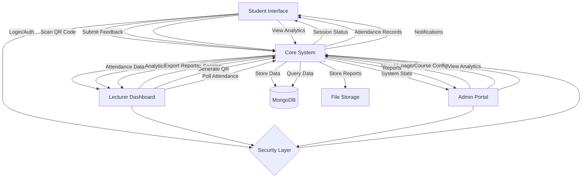
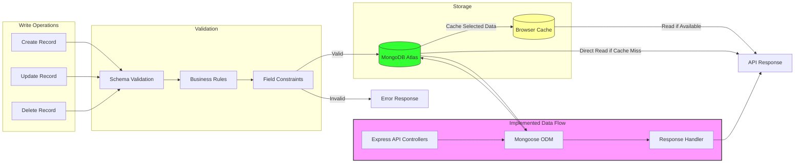

CHAPTER 4: 
SYSTEM DESIGN

Introduction
The Quick Response Code (QR Code)-based Student Attendance System is a Progressive Web Application (PWA) designed to modernize student attendance tracking. The system is built using:

Technical Architecture:
- Frontend: React.js with Vite, Ant Design User Interface (UI) framework
- Backend: Node.js, Express
- Database: MongoDB with Mongoose Object Data Modeling (ODM)
- Application Programming Interface (API): Representational State Transfer (RESTful) architecture with JavaScript Object Notation Web Token (JWT) authentication
- Data Persistence: Browser localStorage with basic IndexedDB integration
- Deployment: Client on Vercel, Server on Render.com

Core Components:
1. Frontend Application
   - Progressive Web Application (PWA) with basic offline capabilities
   - Ant Design User Interface (UI) components with custom theming (light/dark mode)
   - Quick Response (QR) code scanner integration using device cameras
   - Auto-refreshing data through polling mechanisms
   - Local storage for session management and caching

2. Backend Services
   - Express Representational State Transfer (REST) Application Programming Interface (API) endpoints with Model-View-Controller (MVC) architecture
   - JavaScript Object Notation Web Token (JWT) authentication with token refresh mechanism
   - Rate limiting to prevent abuse
   - Comma-Separated Values (CSV) file handling for bulk imports/exports
   - MongoDB data operations with Mongoose Object Data Modeling (ODM)

3. Database Architecture
   - Document-based MongoDB collections
   - Core collections: Users, Sessions, Attendance, Units, Courses, Departments
   - Reference-based relationships through MongoDB Object IDs

Requirements
Functional Requirements:

1. Authentication & Authorization
   - JavaScript Object Notation Web Token (JWT)-based secure authentication with refresh tokens
   - Role-based access control (Admin/Lecturer/Student)
   - Password reset functionality
   - Device identification for security

2. Session Management
   - Quick Response (QR) code generation with automatic refresh every 3 minutes
   - Session state persistence using localStorage
   - Session timing controls (start/end)
   - Manual attendance status overrides by lecturers

3. Anti-Spoofing Measures
   - Device fingerprinting through browser information (userAgent, platform, screenWidth, screenHeight, colorDepth, pixelDepth, hardwareConcurrency, language)
   - Internet Protocol (IP) address tracking and time-based conflict detection
   - Quick Response (QR) code expiration and rotation with Secure Hash Algorithm 256 (SHA-256) hash verification
   - Session token validation
   - Rate limiting on sensitive endpoints

4. Data Management
   - Bulk student import/export via Comma-Separated Values (CSV)
   - Course and unit management
   - Department organization
   - Attendance records export in Comma-Separated Values (CSV)/Excel format
   - Basic analytics and reporting

5. User Experience
   - Responsive design for mobile and desktop
   - Light/dark theme support
   - Offline access to previously loaded data
   - Basic caching for performance

Non-Functional Requirements:
1. Security
   - Secure authentication with JavaScript Object Notation Web Token (JWT)
   - Device fingerprinting validation
   - Role-based access control
   - Input validation and sanitization
   - Application Programming Interface (API) rate limiting

2. Performance
   - Optimized database queries
   - Client-side caching of frequently accessed data
   - Basic offline functionality through localStorage
   - Automatic data refresh mechanisms

3. Usability
   - Responsive mobile-first design
   - Intuitive user interface with Ant Design
   - Theme customization (light/dark mode)
   - Cross-browser compatibility

4. Reliability
   - Error handling and user feedback
   - Automatic session cleanup
   - Token refresh mechanism
   - Data validation

5. Scalability
   - Modular architecture
   - Separate frontend/backend for independent scaling
   - Cloud deployment ready
   - Application Programming Interface (API)-based architecture for future extensibility

6. Maintainability
   - Component-based frontend design
   - Model-View-Controller (MVC) pattern in backend
   - Central configuration
   - Environment variable management

Context Level Diagram
The following diagram illustrates the high-level context of the Quick Response Code (QR Code)-based Smart Attendance System:

```mermaid
graph TD
    %% Main System
    SYS[Quick Response Code-based Smart<br>Attendance System] 
    
    %% External Actors
    STU[Student]
    LEC[Lecturer]
    ADM[Administrator]
    DB[(MongoDB Database)]
    STORE[CSV/Excel Export Storage]
    
    %% Interactions - Students
    STU -->|Authenticates via JWT| SYS
    STU -->|Scans QR codes with device fingerprinting| SYS
    STU -->|Views attendance history| SYS
    STU -->|Submits session feedback| SYS
    SYS -->|Returns attendance status| STU
    SYS -->|Displays feedback request notifications| STU
    
    %% Interactions - Lecturers
    LEC -->|Authenticates via JWT| SYS
    LEC -->|Creates attendance sessions| SYS
    LEC -->|Generates QR codes with auto-refresh| SYS
    LEC -->|Uses polling for attendance data updates| SYS
    LEC -->|Exports attendance reports| SYS
    SYS -->|Displays attendance data| LEC
    SYS -->|Provides unit/course analytics| LEC
    
    %% Interactions - Admins
    ADM -->|Authenticates via JWT| SYS
    ADM -->|Manages user accounts| SYS
    ADM -->|Configures courses/units/departments| SYS
    ADM -->|Views system analytics| SYS
    SYS -->|Provides administrative reports| ADM
    
    %% Interactions - External Systems
    SYS <-->|Stores/retrieves data| DB
    SYS -->|Generates exportable reports| STORE
    
    %% Styling
    classDef system fill:#f96,stroke:#333,stroke-width:2px;
    classDef users fill:#bbf,stroke:#333,stroke-width:1px;
    classDef external fill:#bfb,stroke:#333,stroke-width:1px;
    
    class SYS system;
    class STU,LEC,ADM users;
    class DB,STORE external;
```

This diagram represents the Quick Response Code (QR Code)-based Smart Attendance System, showing:

1. The three user roles (Students, Lecturers, Administrators) with their system interactions
2. External systems integration with MongoDB database and report export functionality
3. The key data flows in the system, including:
   - JavaScript Object Notation Web Token (JWT) authentication for all users
   - Device fingerprinting for anti-spoofing measures
   - Auto-refreshing Quick Response (QR) codes with 3-minute rotation
   - Polling-based data refresh
   - Comma-Separated Values (CSV)/Excel data export capabilities
   - In-app notifications for pending feedback requests

Data Flow Diagram:
[Context Level Data Flow]

1. Student → System:
   - Login credentials
   - Quick Response (QR) code scans
   - Session feedback
   - Device fingerprint
   - Attendance records requests

2. System → Student:
   - Authentication tokens
   - Session status updates
   - Attendance confirmations
   - Course analytics
   - Unit-wise reports
   - In-app notifications

3. Lecturer → System:
   - Session creation requests
   - Quick Response (QR) code generation triggers
   - Attendance data polling
   - Report generation requests
   - Student performance queries

4. System → Lecturer:
   - Attendance data
   - Session analytics
   - Student feedback reports
   - Course performance metrics
   - Export data (CSV/Excel)

5. Admin → System:
   - User management operations
   - Course/Unit configurations
   - System settings updates
   - Bulk data imports
   - Analytics requests

6. System → Admin:
   - System-wide analytics
   - User activity logs
   - Performance reports
   - Audit trails
   - Export data (All formats)

7. External Services ↔ System:
   - Database: CRUD operations
   - File system: Report storage

8. Cross-Cutting Flows:
   - JavaScript Object Notation Web Token (JWT) tokens for authentication
   - Device fingerprints for verification
   - Polling for data updates
   - Browser storage synchronization
   - Error logs and alerts

Data Flow Implementation (Mermaid Compatible):

Database Operations Flow:

Database Design
Normalization Analysis:

1. First Normal Form (1NF)
   - All tables have primary keys (_id)
   - Each column contains atomic values
   - No repeating groups
   
2. Second Normal Form (2NF)
   - Meets 1NF
   - No partial dependencies
   - Tables organized by complete functional dependencies

